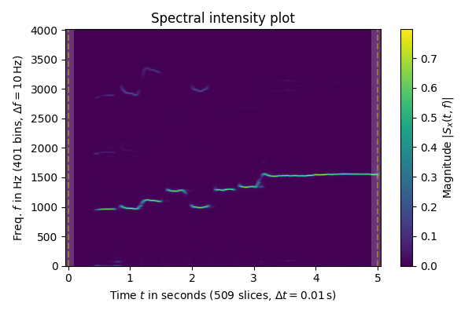
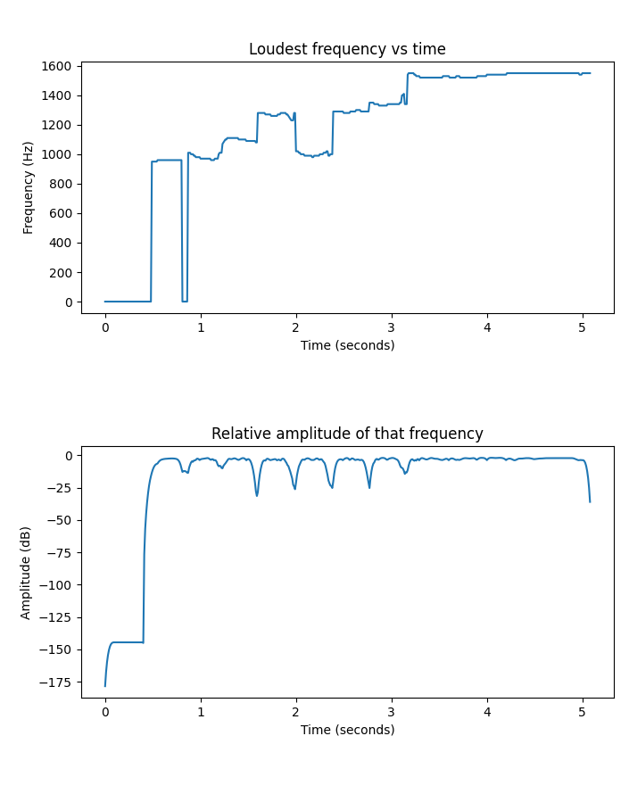

# harmony
melodic dictation + automatic harmonization

# Progress so far

# To Do
- Determine breaks in notes
- Transcribe to MIDI file
- Estimate scale
- Add harmonized part one third (in the scale) above the melody
- Add a third part to complete the triad, following rules of counterpoint
- Add bass, mostly following the root of the chords
